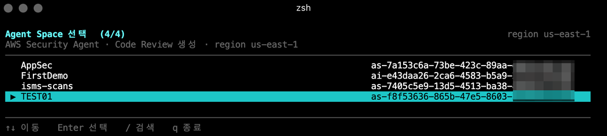

# create_code_review

AWS Security Agent 의 **Code Review** 를 터미널에서 단계별로 만들어 주는 TUI 도구입니다.



## 왜 만들었나

Code Review 를 만들 때 연결할 Repository 가 많아지면 그 선택 과정이 가장 번거롭습니다.
CLI 로 하려면 Repository 마다 `integrationId` 와 `providerResourceId` 를 미리 조회해서
`--assets` JSON 에 직접 적어야 합니다.

```bash
# 이걸 손으로 쓰는 대신…
aws securityagent create-code-review \
  --agent-space-id "as-f8f5..." --title "multi-repo-review" \
  --service-role "arn:aws:iam::111122223333:role/service-role/..." \
  --assets '{"integratedRepositories":[
    {"integrationId":"i-0e8d...","providerResourceId":"1217762376","branch":"main"},
    {"integrationId":"i-0e8d...","providerResourceId":"1124996942","branch":"main"}]}'
```

이 도구는 Agent Space → Integration → Repository 를 **목록에서 골라** 같은 작업을 하게 해 줍니다.
Repository 는 `Space` 키로 여러 개를 토글하고, `/` 로 이름을 검색해 걸러낼 수 있습니다.
`integrationId` / `providerResourceId` / `serviceRole` 은 도구가 조회해서 채웁니다.

## 설치

```bash
pip install boto3          # Python 3.10+
chmod +x create_code_review.py
```

AWS 자격 증명은 `aws configure` 또는 `AWS_PROFILE` 을 사용합니다.

## 사용법

```bash
# 대화형으로 처음부터
./create_code_review.py --region us-east-1

# Agent Space 를 알고 있으면 선택 화면을 건너뛰기
./create_code_review.py --agent-space-id as-f8f53636-865b-47e5-8603-2ecadfe0fdf3

# 생성 후 바로 실행 + 진행 상태 감시
./create_code_review.py --agent-space-id as-... --title multi-repo-review --start

# 만들지 않고 동일 작업의 aws CLI 명령만 확인
./create_code_review.py --agent-space-id as-... --dry-run
```

전체 옵션은 `./create_code_review.py --help` 를 참고하세요.

## 진행 순서

1. **Agent Space 선택** (위 스크린샷)
2. **Integration 선택** — GitHub/GitLab/Bitbucket 연동 목록, 이름과 `integrationId` 를 함께 표시
3. **Repository 다중 선택** — 이름, `providerResourceId`, 브랜치, 소속 Integration 을 한눈에 표시
4. **옵션 입력** — title, 브랜치, remediation, validation, maxTaskHours, serviceRole
   (`serviceRole` 은 기존 Code Review / Pentest / Agent Space 에서 자동으로 찾아 채웁니다)
5. **최종 확인** — 생성될 내용과 동일한 `aws` CLI 명령을 보여주고 승인을 받습니다
6. **생성 → 실행** — 승인하면 만들고, 이어서 실행할지 물어본 뒤 step/task 진행 상태를 표시합니다

## 키 조작

| 키 | 동작 |
| --- | --- |
| `↑` `↓` | 이동 |
| `Space` | 선택 토글 |
| `a` / `n` | 전체 선택 / 전체 해제 |
| `/` | 이름·ID 검색 필터 |
| `b` / `B` | 커서 항목 / 선택 항목 전체의 브랜치 변경 |
| `Enter` | 다음 단계 (옵션 화면에서는 값 편집) |
| `c` | 옵션 화면에서 다음 단계로 |
| `y` | 최종 확인 화면에서 생성 |
| `q` `Esc` | 취소 또는 이전 화면 |

진행 상태 감시 중 `Ctrl-C` 를 누르면 감시만 멈추고 Job 은 계속 실행됩니다.
(상태 확인·중지용 CLI 명령을 함께 출력합니다.)
