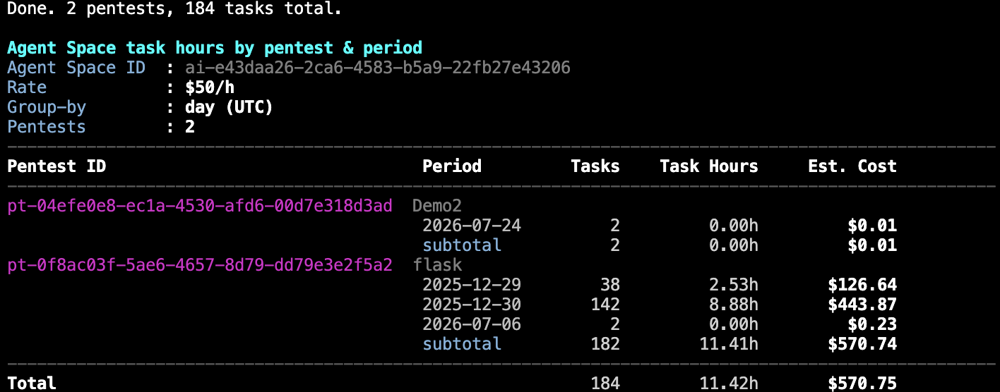
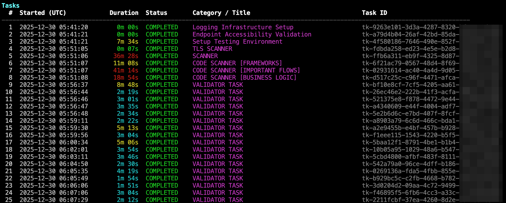
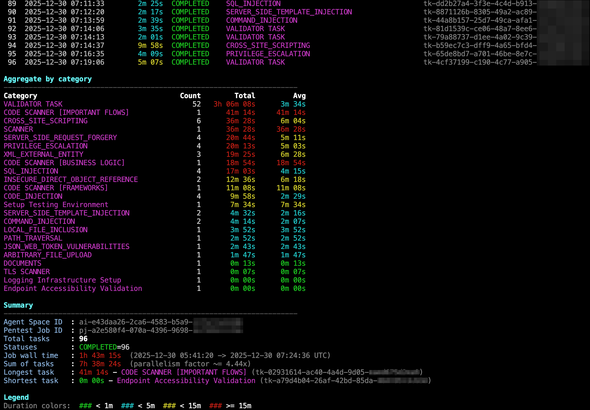

# AWS Security Agent - Pentest Task Duration & Cost Reporter

AWS Security Agent가 실행한 **Penetration Test Job**의 각 Task별 소요 시간을
자동으로 집계·시각화하고, Agent Space / Pentest / Job 계층 스코프별로 총
Task Hour 와 **예상 비용**을 계산해 주는 CLI 도구입니다. AWS CLI
(`aws securityagent ...`)를 페이지네이션으로 호출해 대상 스코프에 속한 모든
task를 수집한 뒤, 각 task의 `updatedAt - createdAt`을 duration으로 계산합니다.

## 목적

Security Agent의 Pentest Job은 하나의 실행에 수십~수백 개의 sub-task
(scanner, code scanner, validator, 각종 취약점 카테고리 등)를 병렬로 돌립니다.
콘솔에서는 개별 task 단위 실행 시간이 한눈에 보이지 않아, 어느 카테고리에
시간이 많이 소요됐는지, 병렬도가 얼마나 나왔는지, 어떤 task가 가장 오래
걸렸는지 파악하기가 번거롭습니다. 또한 **Agent Space 전체 / 특정 Pentest**
관점에서 기간별로 Task Hour와 예상 비용을 확인하려면 여러 API를 조합해야
합니다.

이 도구는 다음을 자동으로 처리합니다.

- **세 가지 스코프** 자동 분기
  - Agent Space 전체 (모드 A): 해당 space의 모든 pentest에 대해 기간별 Task Hour · 예상 비용
  - 특정 Pentest (모드 B): 해당 pentest의 모든 job을 flatten 해서 기간별 Task Hour · 예상 비용
  - 특정 Pentest Job (모드 C): 기존 job 단위 상세 리포트 (task 표 / 카테고리별 집계 / 요약)
- **기간별 group-by** (`--group-by day|month|year`) - task의 `createdAt` 기준
- **시간대** 기본 UTC, `--local` 지정 시 Asia/Seoul(KST)로 group / 표시
- **예상 비용** 계산 - `Task Hours × $50` (요율은 스크립트 상수 `HOURLY_RATE_USD` 에서 조정)
- **ID 트리 뷰** (`--list-ids`) - Agent Space / Pentest / Pentest Job ID를 한 화면에
- **UI Task hours 근사값 병기 (모드 C)** - 콘솔의 "Task hours"와 스크립트의
  `Sum of tasks` 사이에 차이가 나는 job을 위해, 특정 카테고리
  (`VALIDATOR TASK`, `CLEANUP AGENT [*]`, 하우스키핑 계열)를 뺀 여러 후보
  값을 Summary에 함께 출력합니다. `--exclude-category` 로 사용자 정의
  필터도 추가 가능
- 오래 걸리는 조회 중 stderr에 **스피너** 표시로 진행 여부를 시각화
- `--json` 옵션으로 파이프라인/후처리용 원본 데이터 출력
- Duration 구간에 따라 **컬러**로 hotspot을 즉시 식별

> **예상 비용 안내**: 이 도구의 "Est. Cost" 는 단순히 `수집된 Task Hour × $50`
> 을 곱한 **예상값**입니다. 실제 AWS 청구 금액과는 다를 수 있습니다 —
> 요금 정책 변경, 미터링 반올림, 실패/재시도 task 처리, 프리 티어 등 다양한
> 요인이 반영되지 않습니다. 실제 비용은 AWS 콘솔의 Billing 대시보드를
> 확인하세요.

## 요구 사항

- Python 3.9+ (`zoneinfo` 사용, 3.9 이상)
- AWS CLI v1/v2 (`aws securityagent ...` 명령이 사용 가능한 버전)
- 대상 Agent Space / Pentest / Pentest Job 에 접근 가능한 AWS 자격 증명

## 사전 설정 - 기본값 교체

스크립트 상단에는 리전 · Agent Space ID · Pentest Job ID 세 상수가
플레이스홀더로 비워져 있습니다. 자주 조회하는 값이 있다면 상수를
직접 채우고, 상황별로 다른 스코프를 조회할 때는 CLI 옵션으로
override 하면 됩니다.

```python
DEFAULT_REGION = "[리전 값을 입력, 예: us-east-1]"
DEFAULT_AGENT_SPACE_ID = "[Agent Space ID 값을 입력, 예: as-xxxxxxxx-xxxx-xxxx-xxxx-xxxxxxxxxxxx]"
DEFAULT_PENTEST_JOB_ID = "[Pentest Job ID 값을 입력, 예: pj-xxxxxxxx-xxxx-xxxx-xxxx-xxxxxxxxxxxx]"

# 시간당 요금 (USD). 예상 비용 계산에만 사용됨.
HOURLY_RATE_USD = 50
```

| 상수 | 어디에서 확인하나요 |
|---|---|
| `DEFAULT_REGION` | Security Agent가 배포된 AWS 리전 (예: `us-east-1`). |
| `DEFAULT_AGENT_SPACE_ID` | `aws securityagent list-agent-spaces --region <리전>` 결과 또는 콘솔의 Agent Space 상세 페이지. |
| `DEFAULT_PENTEST_JOB_ID` | 콘솔의 Pentest Job 상세 페이지 또는 `aws securityagent list-pentest-jobs-for-pentest` 결과. |
| `HOURLY_RATE_USD` | 예상 비용 계산에만 쓰이는 시간당 요금(USD). 기본 `50`. |

> `--agent-space-id`, `--pentest-job-id`가 플레이스홀더 상태이고 CLI 옵션으로도
> 넘기지 않으면 (해당 모드가 필요로 하는 경우) 스크립트는 실행을 중단하고
> 어떤 값을 채워야 하는지 알려줍니다. `--list-ids` 모드는 예외로,
> `--agent-space-id`가 없으면 리전 내 모든 Agent Space를 열거합니다.

## 실행 모드

세 스코프 옵션(`--agent-space-id` / `--pentest-id` / `--pentest-job-id`)의 조합으로
모드가 자동 결정됩니다. `--pentest-id`와 `--pentest-job-id`는 상호 배타입니다.

| 모드 | 입력 조합 | 스코프 | 출력 |
|---|---|---|---|
| **A. Agent Space** | `--agent-space-id as-...` 만 | 해당 space의 모든 pentest | pentest별 기간 group + 소계 + 총합 (Task Hours / Est. Cost) |
| **B. Pentest** | `--agent-space-id as-... --pentest-id pt-...` | 해당 pentest의 모든 job의 task | 기간별 Task Hours / Est. Cost |
| **C. Pentest Job** | `--agent-space-id as-... --pentest-job-id pj-...` | 단일 job | Task 표 + 카테고리별 집계 + Job 요약 (기존 기능) |
| **ID 리스트** | `--list-ids` (다른 스코프 옵션 조합 가능) | Agent Space / Pentest / Job ID 트리 | ID 트리 뷰 |

## 사용법

```bash
# 모드 A: Agent Space 전체를 월별로 집계
python3 pentest_task_durations.py \
  --region us-east-1 \
  --agent-space-id as-xxxxxxxx-xxxx-xxxx-xxxx-xxxxxxxxxxxx \
  --group-by month

# 모드 B: 특정 Pentest를 일별로 집계 (KST 기준)
python3 pentest_task_durations.py \
  --region us-east-1 \
  --agent-space-id as-xxxxxxxx-xxxx-xxxx-xxxx-xxxxxxxxxxxx \
  --pentest-id pt-xxxxxxxx-xxxx-xxxx-xxxx-xxxxxxxxxxxx \
  --group-by day --local

# 모드 C: 단일 Job 상세 (기존 기능)
python3 pentest_task_durations.py \
  --region us-east-1 \
  --agent-space-id as-xxxxxxxx-xxxx-xxxx-xxxx-xxxxxxxxxxxx \
  --pentest-job-id pj-xxxxxxxx-xxxx-xxxx-xxxx-xxxxxxxxxxxx

# 모드 C + 사용자 정의 필터 (UI Task hours와 대조하고 싶은 경우)
python3 pentest_task_durations.py \
  --region us-east-1 \
  --agent-space-id as-xxxxxxxx-xxxx-xxxx-xxxx-xxxxxxxxxxxx \
  --pentest-job-id pj-xxxxxxxx-xxxx-xxxx-xxxx-xxxxxxxxxxxx \
  --exclude-category "VALIDATOR TASK" --exclude-category "CLEANUP AGENT*"

# ID 트리 - 리전 내 모든 Agent Space 열거
python3 pentest_task_durations.py --region us-east-1 --list-ids

# ID 트리 - 특정 Agent Space만
python3 pentest_task_durations.py \
  --region us-east-1 \
  --agent-space-id as-xxxxxxxx-xxxx-xxxx-xxxx-xxxxxxxxxxxx \
  --list-ids

# 후처리용 JSON 출력 (모든 모드 지원)
python3 pentest_task_durations.py \
  --region us-east-1 --agent-space-id as-... --group-by day --json > report.json
```

## 스크린샷

### 기간별 Task Hours & 예상 비용 (모드 A · 월별 그룹핑)

Agent Space 전체의 pentest에 대해 `--group-by month` 옵션으로 월별
Task Hours와 예상 비용을 산출한 결과입니다.



### 기존 Job 단위 리포트 (모드 C)

단일 Job의 task 목록과 카테고리별 집계, 그리고 job 요약입니다.
Duration 구간에 따라 초록/시안/노랑/빨강으로 컬러가 입혀져
오래 걸린 task가 즉시 눈에 띕니다.





## `--help` 출력

```
usage: pentest_task_durations.py [-h] [--region REGION]
                                 [--agent-space-id AGENT_SPACE_ID]
                                 [--pentest-id PENTEST_ID]
                                 [--pentest-job-id PENTEST_JOB_ID]
                                 [--group-by {day,month,year}] [--local]
                                 [--color {auto,always,never}] [--no-color]
                                 [--no-legend]
                                 [--exclude-category PATTERN]
                                 [--list-ids] [--json] [--verbose]

AWS Security Agent - Pentest Job task duration reporter.

options:
  -h, --help            show this help message and exit
  --region REGION       AWS region. Set DEFAULT_REGION in the script or pass
                        this flag.
  --agent-space-id AGENT_SPACE_ID
                        Agent Space ID. Set DEFAULT_AGENT_SPACE_ID in the
                        script or pass this flag.
  --pentest-id PENTEST_ID
                        Pentest ID (pt-...). If set, reports task hours by
                        period across all jobs under this pentest.
  --pentest-job-id PENTEST_JOB_ID
                        Pentest Job ID. Set DEFAULT_PENTEST_JOB_ID in the
                        script or pass this flag.
  --group-by {day,month,year}
                        Period granularity for agent-space / pentest reports
                        (default: day).
  --local               Group and display timestamps in local time
                        (Asia/Seoul). Default is UTC.
  --color {auto,always,never}
                        Colorize output. 'auto' (default) enables when stdout
                        is a TTY and NO_COLOR is unset.
  --no-color            Shortcut for --color never.
  --no-legend           Hide the duration-color legend.
  --exclude-category PATTERN
                        (mode C) Extra category pattern to exclude in a
                        'excl. user' summary line. Case-insensitive fnmatch
                        (e.g. "CLEANUP AGENT*"). May be repeated. Does not
                        affect the main task table or the per-category
                        aggregate.
  --list-ids            List Agent Space / Pentest / Pentest Job IDs in the
                        given agent space and exit. If --pentest-id is also
                        set, only that pentest's jobs are shown.
  --json                Emit rows as JSON instead of tables (implies --no-
                        color).
  --verbose, -v         Verbose progress: show every phase/page as a separate
                        line instead of a spinner.
```

## 옵션 상세 설명

| 옵션 | 기본값 | 설명 |
|---|---|---|
| `-h`, `--help` | - | 도움말을 출력하고 종료합니다. |
| `--region` | 스크립트 `DEFAULT_REGION` 값 | AWS CLI가 사용할 리전. Security Agent가 배포된 리전과 일치해야 합니다. |
| `--agent-space-id` | 스크립트 `DEFAULT_AGENT_SPACE_ID` 값 | 조회 대상 Agent Space ID. `--list-ids` 이외 모드에서는 필수. |
| `--pentest-id` | 없음 | Pentest ID (`pt-...`). 지정 시 **모드 B**로 진입해 해당 pentest의 모든 job task를 기간별로 집계합니다. `--pentest-job-id`와 상호 배타. |
| `--pentest-job-id` | 스크립트 `DEFAULT_PENTEST_JOB_ID` 값 | Pentest Job ID (`pj-...`). 지정 시 **모드 C**로 진입해 기존 job 단위 상세를 출력합니다. `--pentest-id`와 상호 배타. |
| `--group-by {day,month,year}` | `day` | 모드 A/B의 기간 group 단위. Task의 `createdAt` 기준. |
| `--local` | off | 지정 시 KST(Asia/Seoul) 기준으로 group / 표시. 기본은 UTC. |
| `--list-ids` | off | Agent Space / Pentest / Pentest Job ID를 트리로 출력하고 종료합니다. `--agent-space-id` 미지정 시 리전 내 모든 Agent Space를 열거. `--pentest-id`와 함께 쓰면 해당 pentest의 job만. |
| `--color {auto,always,never}` | `auto` | 컬러 출력 방식. `auto`는 stdout이 터미널(TTY)이고 `NO_COLOR` 환경변수가 없을 때만 컬러를 켭니다. |
| `--no-color` | off | `--color never`의 단축형. |
| `--no-legend` | off | 모드 C 출력의 duration 컬러 legend를 감춥니다. |
| `--exclude-category PATTERN` | 없음 | (모드 C 전용) UI Task hours 근사 비교용 사용자 필터. 대소문자 무시 fnmatch 패턴을 받아 Summary의 `excl. user` 라인에만 반영합니다. 반복 지정 가능. 상단 Task 표/카테고리 집계에는 영향을 주지 않습니다. 예: `--exclude-category "CLEANUP AGENT*"`. |
| `--json` | off | 표 대신 각 모드의 결과를 JSON으로 출력합니다. 컬러 자동 off. |
| `--verbose`, `-v` | off | 스피너 대신 매 페이지/페이즈를 별도 라인으로 stderr에 출력. |

### 컬러 규칙 (모드 C)

- **Duration**: `< 1분` 초록 · `< 5분` 시안 · `< 15분` 노랑 · `≥ 15분` 빨강
- **Status**: `COMPLETED` 초록 · `FAILED`/`ERROR`/`CANCELLED`/`STOPPED` 빨강 ·
  `RUNNING`/`IN_PROGRESS`/`PENDING`/`QUEUED` 노랑 · 그 외 시안
- **카테고리**: 마젠타 / **Task ID**: 옅은 회색 / **섹션 제목**: 볼드 시안

## 예상 비용 산정 방식

- **Task duration** = `updatedAt - createdAt` (task summary API 필드)
- **Task Hours** = `sum(duration_seconds) / 3600`
- **Est. Cost** = `Task Hours × HOURLY_RATE_USD` (기본 $50)

**주의사항 (실제 청구 금액과의 차이)**:

- 이 값은 **API의 `updatedAt - createdAt` 만으로 계산한 예상값**이며 실제
  AWS 청구 금액과 다를 수 있습니다.
- 요금 정책이 변경되거나 리전별 요금이 다를 수 있습니다.
- 실패한 task, 재시도된 task, 중단된 task 등의 실제 과금 여부는 반영되지 않습니다.
- 미터링/청구 시점의 반올림, 프리 티어, 프로모션 크레딧 등은 계산에 포함되지 않습니다.
- AWS 콘솔의 Run Overview에 표시되는 Task hours 값과도 차이가 날 수 있습니다
  (콘솔 백엔드가 별도 지표를 사용할 수 있음).
- 정확한 청구 금액은 반드시 **AWS Billing 대시보드**를 확인하세요.

요율을 다르게 산정하려면 스크립트 상단 `HOURLY_RATE_USD` 상수를 직접 수정하면 됩니다.

## UI Task hours 근사값 (모드 C)

콘솔 Run overview의 **"Task hours"** 는 서비스가 미터링에 사용하는 권위값
(authoritative)입니다. 스크립트의 `Sum of tasks` 는 공개 API의
`updatedAt - createdAt` 을 단순 합산한 값이라, 특정 카테고리(VALIDATOR /
CLEANUP / 하우스키핑 계열)를 서비스가 집계에서 빼는 경우 두 값 사이에
차이가 생깁니다.

모드 C(단일 Job 상세)의 Summary 하단에는 이 차이를 이해하기 쉽게
후보 값들이 함께 출력됩니다. 해당 카테고리에 속한 task가 실제로 있는
경우에만 라인이 나타납니다.

```
Sum of tasks       : 19h 00m 47s  (parallelism factor ~= 3.72x)
  excl. VALIDATOR  : 14h 30m 38s  (-4h 30m 09s, 39 tasks)
  excl. CLEANUP    : 16h 48m 35s  (-2h 12m 12s, 5 tasks)
  excl. both       : 12h 18m 26s  (-6h 42m 21s, 44 tasks)  <- UI Task hours approx.
  excl. + housekeep: 12h 16m 35s  (-6h 44m 12s, 47 tasks)  (+Setup/Logging/Endpoint)
  excl. user       : ...                                     [사용자 지정 패턴]
```

- `excl. VALIDATOR` — `VALIDATOR TASK` 만 제외
- `excl. CLEANUP` — `CLEANUP AGENT [*]` 만 제외
- `excl. both` — VALIDATOR + CLEANUP 을 함께 제외 (관측치 기반 UI 근사값)
- `excl. + housekeep` — 위에 `Setup Testing Environment` /
  `Logging Infrastructure Setup` / `Endpoint Accessibility Validation` 까지 추가 제외
- `excl. user` — `--exclude-category PATTERN` 으로 넘긴 패턴만 제외

`--exclude-category` 는 대소문자 무시 fnmatch 로 매칭하며 여러 번 반복해서
지정할 수 있습니다:

```bash
python3 pentest_task_durations.py \
  --region us-east-1 \
  --agent-space-id as-... \
  --pentest-job-id pj-... \
  --exclude-category "VALIDATOR TASK" \
  --exclude-category "CLEANUP AGENT*"
```

**NOTICE** — 이 라인들은 관측치 기반 heuristic 근사값이며 서비스의 실제
미터링 규칙이 아닙니다. 정확한 값은 콘솔의 **Task hours** 를 신뢰하세요.
스크립트 실행 시 Summary 아래에 노란색 NOTICE 로도 같은 문구가 표시됩니다.

## 팁

- `less`로 컬러 출력을 그대로 보려면 `--color always`와 `less -R`를 함께
  사용하세요: `python3 pentest_task_durations.py --color always | less -R`
- `NO_COLOR=1` 환경변수만 세팅해도 `auto` 모드에서 컬러가 꺼집니다.
- JSON 출력은 각 모드마다 다른 스키마를 가집니다 (job 상세 / 기간별 집계 /
  ID 트리). `jq`나 스프레드시트 임포트로 후처리하기 쉽습니다.
- 오래 걸리는 모드 A 조회 시 stderr에 스피너가 회전합니다. 파이프/리다이렉트
  환경에서도 페이즈 라인이 남아 진행 여부를 추적할 수 있습니다.
- 콘솔 Task hours와 스크립트 값이 안 맞는 job이 보이면, 어떤 카테고리를
  UI가 빼고 있는지 좁혀볼 때 `--exclude-category` 를 반복해서 넣고 Summary의
  `excl. user` 라인이 콘솔 값과 일치하는지 확인해 보세요.
