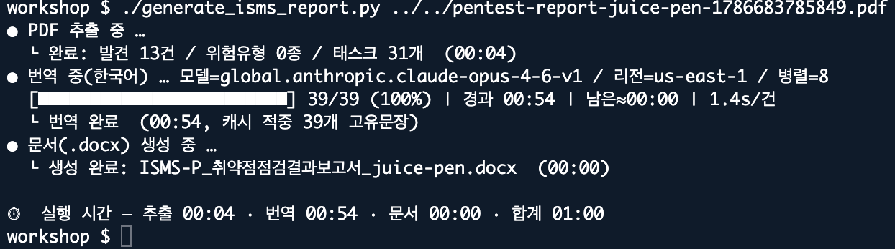
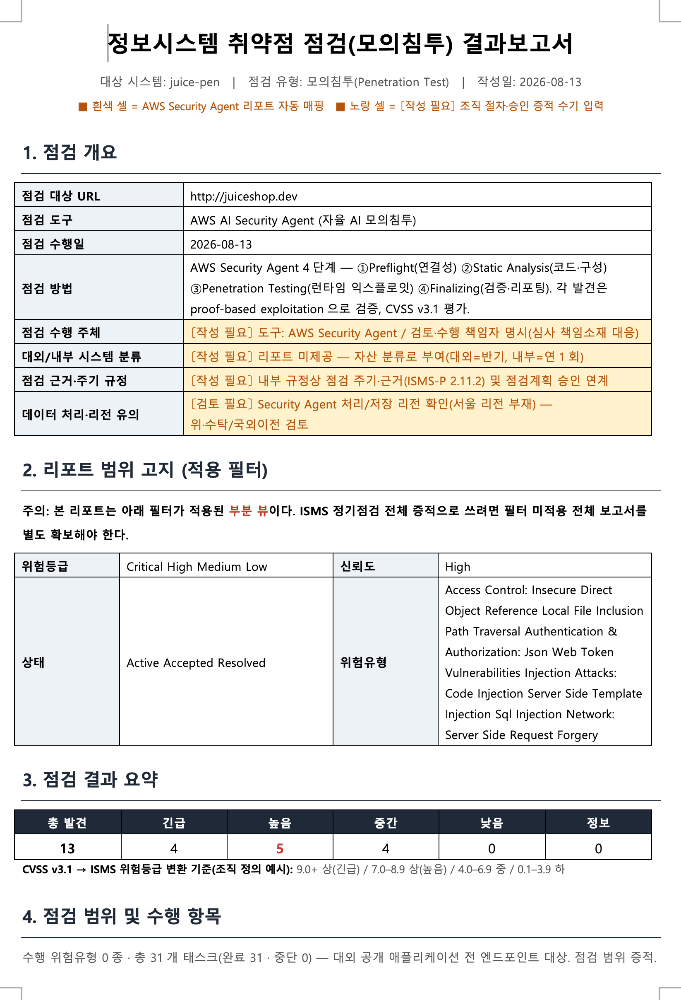

# AWS Security Agent 워크샵

AWS Security Agent 를 활용할 수 있는 방법들을 배워보기 위한 스크립트를 제공합니다.

---

## 스크립트 목록

| 파일 | 설명 |
| --- | --- |
| `list_findings.py` | Security Agent 발견사항(Findings)을 목록으로 출력 |
| `translate_findings.py` | 발견사항 이름을 Amazon Bedrock(Claude)으로 한국어 번역하여 출력 |
| `generate_isms_report.py` | Penetration PDF → ISMS-P 취약점 점검 결과보고서(.docx) 자동 생성 |

---

## 1. list_findings.py

Security Agent의 `list-findings` API를 호출하여 발견사항(RiskType, RiskLevel, Name)을 터미널에 출력합니다.

```bash
# SPACE_ID, JOB_ID를 실제 값으로 변경 후 실행
python list_findings.py

```

---

## 2. translate_findings.py

`list_findings.py`의 결과에 **Amazon Bedrock Claude**를 이용한 한국어 번역 컬럼을 추가로 출력합니다.

```bash
# SPACE_ID, JOB_ID, Account ID를 실제 값으로 변경 후 실행
python translate_findings.py

```

---

## 3. generate_isms_report.py

AWS Security Agent가 생성한 **펜테스트 리포트 PDF**를 파싱하여, ISMS-P 인증심사에 제출 가능한 형태의 **취약점 점검 결과보고서(.docx)**를 자동 생성합니다.

### 주요 기능

| 기능 | 설명 |
| --- | --- |
| **PDF 파싱** | `pdfplumber`로 리포트 구조 자동 추출 (대상URL, 점검일, 심각도 카운트, 발견사항 상세 등) |
| **한국어 번역** | Amazon Bedrock Claude(Converse API)로 취약점 설명·재현절차·위험근거를 한국어로 자동 번역 |
| **병렬 번역** | `ThreadPoolExecutor`로 고유 문장 병렬 호출 + 캐시 중복 제거 → 속도 최적화 |
| **DOCX 생성** | `python-docx`로 ISMS-P 양식에 맞는 9개 장(章) 구조의 결과보고서 자동 조립 |
| **ISMS-P 매핑** | 발견 위험유형 → ISMS-P 인증기준 자동 매핑 (2.11.2 직접 증적 + 보조 증적) |
| **수기 입력 가이드** | 조직 절차·승인 증적 등 자동화 불가 영역은 노란색 `〔작성 필요〕` 셀로 표시 |

### 보고서 구성 (9개 장)

1. 점검 개요
2. 리포트 범위 고지 (적용 필터)
3. 점검 결과 요약 (심각도별 카운트)
4. 점검 범위 및 수행 항목 (위험유형·태스크)
5. 발견사항 상세 (CVSS 메트릭, PoC, 위험평가근거)
6. ISMS-P 인증기준 매핑
7. 조치 및 이행점검
8. 미조치 취약점 처리 및 보고·승인
9. 결재

### 사전 요구사항

```bash
pip install pdfplumber python-docx boto3

```

### 사용법

```bash
# 기본 실행 (한국어 번역 포함)
python generate_isms_report.py <펜테스트_리포트.pdf>

# 출력 파일명 지정
python generate_isms_report.py report.pdf output.docx

# 번역 없이 영문 원문 유지
python generate_isms_report.py report.pdf --no-translate

# 모델/리전/병렬 수 지정
python generate_isms_report.py report.pdf \
  --model global.anthropic.claude-opus-4-6-v1 \
  --region us-east-1 \
  --workers 8

```

### 실행 화면




### 최종 결과 보고서 스크린샷



